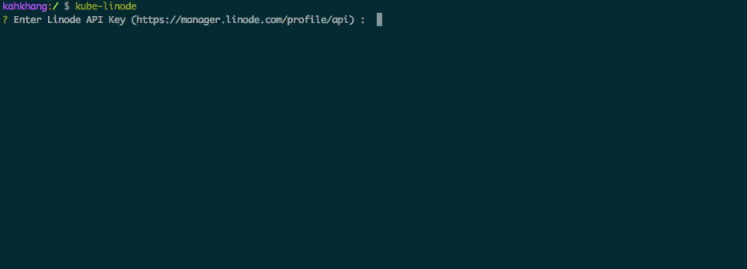

## :whale: Provision a Kubernetes / CoreOS Cluster on Linode
[](https://github.com/kahkhang/kube-linode)
[](https://raw.githubusercontent.com/kahkhang/kube-linode/master/LICENSE)
[](https://gitter.im/kube-linode/support)

Automatically provision a scalable CoreOS/Kubernetes cluster on Linode with zero configuration.



The cluster will comprise of a single Kubernetes master host with a custom number of worker nodes.

### What's included
* [Kubernetes 1.11.0](https://kubernetes.io/) with [Bootkube](https://github.com/kubernetes-incubator/bootkube)
* Load Balancer and automatic SSL/TLS renewal using [Traefik](https://github.com/containous/traefik)
* Distributed block storage with [Rook](https://github.com/rook/rook)
* Pre-configured [Grafana](https://github.com/grafana/grafana) dashboard using [Kube-Prometheus](https://github.com/coreos/prometheus-operator/tree/master/contrib/kube-prometheus) with Rook and Traefik monitoring
* Basic auth protected subdomains (assuming you are using example.com):
  * https://kube.example.com ([Kubernetes Dashboard](https://github.com/kubernetes/dashboard))
  * https://grafana.example.com ([Grafana](https://github.com/grafana/grafana))
  * https://alertmanager.example.com ([Alert Manager](https://github.com/prometheus/alertmanager))
  * https://prometheus.example.com ([Prometheus Web UI](https://github.com/prometheus/prometheus))
  * https://traefik.example.com ([Traefik Web UI](https://github.com/containous/traefik#web-ui))
### Usage
```sh
git clone https://github.com/kahkhang/kube-linode
cd kube-linode
chmod +x kube-linode.sh
```  
Just run `./kube-linode.sh create` into your console, key in your configuration, then sit back and have a :coffee:!  
Settings are stored in `settings.env`, or you can pass them in as key-value flags as such:  
```sh
./kube-linode.sh --no_of_workers=3 --api_key=12345
```  
To increase the number of workers, modify `NO_OF_WORKERS` in `settings.env` as desired and run `./kube-linode.sh` again.  
Use `kubectl` to control the cluster (e.g. `kubectl get nodes`)  
<hr>

If you want to destroy the cluster created by kube-linode, you can run the following command:
```sh
./kube-linode.sh destroy
```  
A prompt will be given listing all the nodes which will be destroyed upon confirmation  .

### Dependencies
You should have a Linode account, which you can get [here](https://www.linode.com/?r=0affaec6ca42ca06f5f2c2d3d8d1ceb354e222c1).
You should also have an API Key with a valid domain that uses [Linode's DNS servers](https://www.linode.com/docs/networking/dns/dns-manager-overview#set-domain-names-to-use-linodes-name-servers).

OSX: ``` brew install jq openssl curl kubectl ```

Arch Linux: Follow the instructions [here](https://github.com/kahkhang/kube-linode/issues/4#issuecomment-311601422)

### Acknowledgements
This script uses [Bootkube](https://github.com/kubernetes-incubator/bootkube) to bootstrap the initial cluster using [Linode's API](https://www.linode.com/api).
